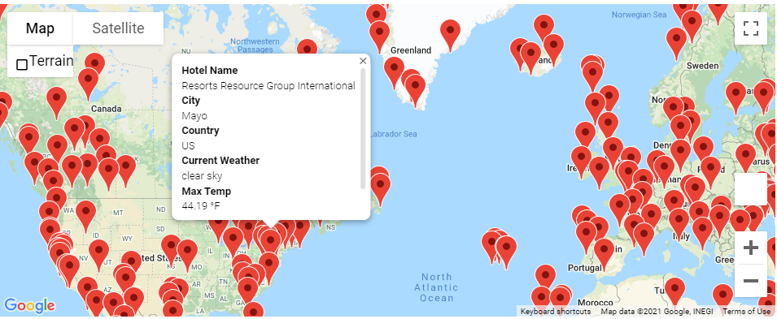
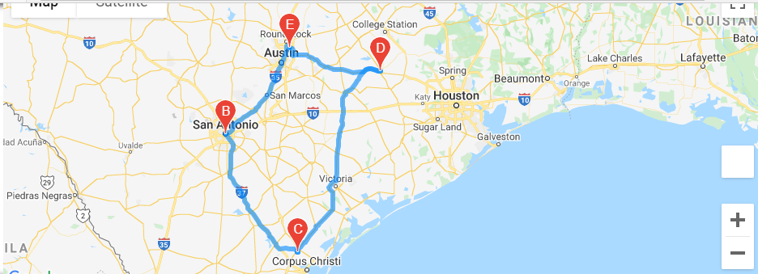

# World_Weather_Analysis

## Overview
The purpose of this project was to collect weather data across a wide range of cities to analyze and create visual representation of the data. Creating this hs the potentional to help travels in determining their destinations based on their preferred weather conditions. Weather conditions are a key factor in many tourists decisions when chosing destinations.

### Resources
- Google Cloud Platform
- OpenWeatherMap
- Python

## Weather Analysis

Data was collected from a random set of 2,000 latitudes and longitudes generated with python. An API call was utilized to collect current weather data for the nearest cities corresponding to the set of latitudes and longitudes. If a city was not in range, the lat and long set was disregarded. 
The results were output to [the Weather Database.](Weather_Database/WeatherPy_database.csv)

The following criteria for the weather analysis was collected for each city:
- Latitude and Longitude
- Maximum Temperature
- Humidity
- Cloudiness
- Wind Speed
- Current Weather Description
- City name and Country name

## Vacation Search

Users are prompted to select their preferred minimum and maximum temperature. Depending on their choice, potential travel desitinations and nearby hotels are mapped out. Pop-up markers allow the user to obtain the information gathered from the Weather Analysis for each city. 

## Vacation Itinerary

A Google Directions API was utilized to determine the route between four potentional city destinations. 

